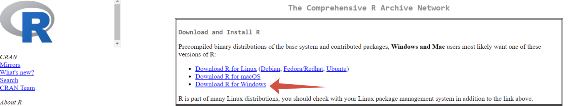

# Практика 000

По дисциплине "Информационно-аналитические технологии поиска угроз инорфмационной безопасности"

Подготовка рабочего окружения для работы с Rstudio

## Цель работы


1. Развить практические навыки использования языка программирования R для
обработки данных

2. Развить навыки работы в Rstudio IDE:

  2.1 установка пакетов
  
  2.2 работа с проектами в Rstudio
  
  3.3 настройка и работа с Git
  
3. Закрепить знания базовых типов данных языка R и простейших операций с ними

## Исходные данные

1. Компьютер
2. ОС Windows
3. Rstudio
4. Библиотека swirl
5. Github

## Общий план выполнения работы

1. Установить интерпретатор R
2. Установить Rstudio IDE
3. Составить отчет и выложить его и исходный qmd/rmd файл в свой репозиторий Github


## Содержание ЛР

### Шаг 1. Установка интерпретатора R

На данном шаге производится настройка рабочего окружения, а именно установка интерпретатора R.
1. На сайте posit скачиваем R.


2. На cran.rstudio.com выбираем интерпретатор R для ОС Windows.




3. С помощью установочного файла загружаем R.


### Шаг 2. Установка Rstudio IDE

На данном шаге продолжается настройка рабочего окружения, а именно установка ПО Rstudio IDE.

1. На сайте posit скачиваем Rstudio


2. С помощью установочного файла загружаем Rstudio.


### Шаг 3. Проверка работоспособности

```{r}
x <- 15+2
x
```
## Оценка результата

Получено рабочее пространство интерпретатора R Rstudio IDE

## Вывод

Выполнена настройка и подключение интерпретатора R и Rstudio IDE