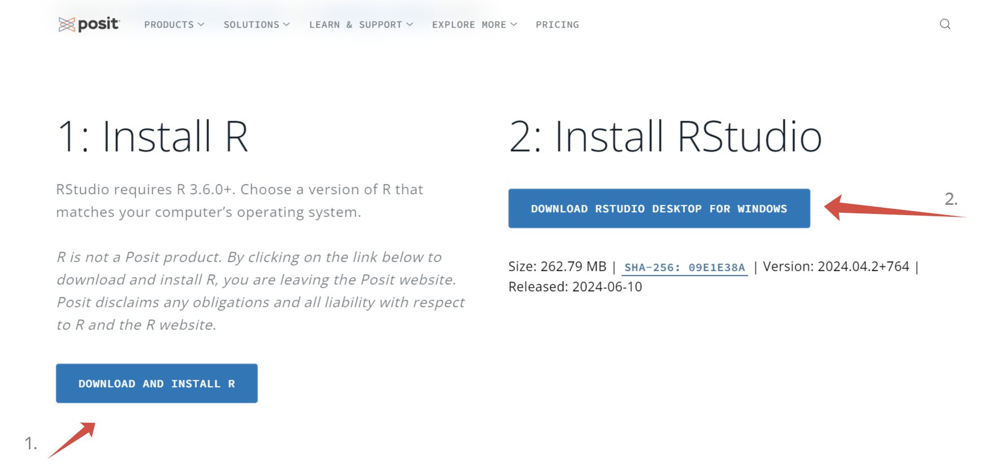
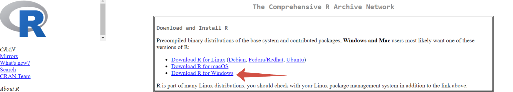
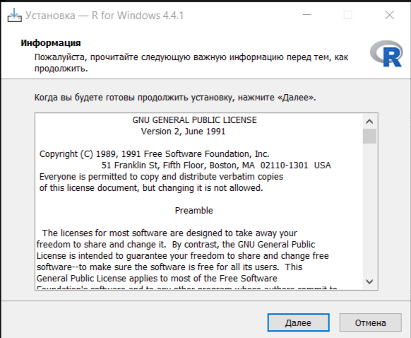
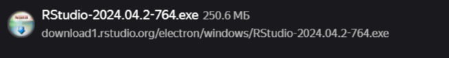

# PR_0
Arikova Kristina
2024-09-07

# Практика 000

По дисциплине “Информационно-аналитические технологии поиска угроз
инорфмационной безопасности”

Подготовка рабочего окружения для работы с Rstudio

## Цель работы

1.  Развить практические навыки использования языка программирования R
    для обработки данных

2.  Развить навыки работы в Rstudio IDE:

2.1 установка пакетов

2.2 работа с проектами в Rstudio

3.3 настройка и работа с Git

1.  Закрепить знания базовых типов данных языка R и простейших операций
    с ними

## Исходные данные

1.  Компьютер
2.  ОС Windows
3.  Rstudio
4.  Библиотека swirl
5.  Github

## Общий план выполнения работы

1.  Установить интерпретатор R
2.  Установить Rstudio IDE
3.  Составить отчет и выложить его и исходный qmd/rmd файл в свой
    репозиторий Github

## Содержание ЛР

### Шаг 1. Установка интерпретатора R

На данном шаге производится настройка рабочего окружения, а именно
установка интерпретатора R. 1. На сайте posit скачиваем R.

<figure>

<figcaption aria-hidden="true"><em>1.1. Установка R</em></figcaption>
</figure>

1.  На cran.rstudio.com выбираем интерпретатор R для ОС Windows.

<figure>

<figcaption aria-hidden="true"><em>1.2. Установка R</em></figcaption>
</figure>

1.  С помощью установочного файла загружаем R.

<figure>

<figcaption aria-hidden="true"><em>1.3. Установка R</em></figcaption>
</figure>

### Шаг 2. Установка Rstudio IDE

На данном шаге продолжается настройка рабочего окружения, а именно
установка ПО Rstudio IDE.

1.  На сайте posit скачиваем Rstudio

<figure>

<figcaption aria-hidden="true"><em>2.1. Установка
Rstudio</em></figcaption>
</figure>

1.  С помощью установочного файла загружаем Rstudio.

<figure>

<figcaption aria-hidden="true"><em>2.2. Установка
Rstudio</em></figcaption>
</figure>
