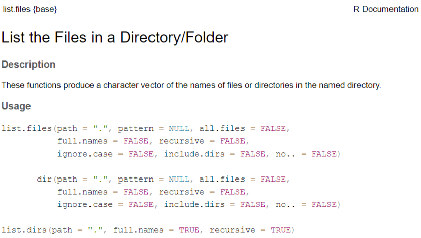

# Практика 001

По дисциплине "Информационно-аналитические технологии поиска угроз инорфмационной безопасности"

Введение в R

## Цель работы


1. Развить практические навыки использования языка программирования R для
обработки данных

2. Развить навыки работы в Rstudio IDE:

  2.1 установка пакетов
  
  2.2 работа с проектами в Rstudio
  
  3.3 настройка и работа с Git
  
3. Закрепить знания базовых типов данных языка R и простейших операций с ними

## Исходные данные

1. Компьютер
2. ОС Windows
3. Rstudio
4. Библиотека swirl
5. Github

## Общий план выполнения работы

1. Установить интерпретатор R
2. Установить Rstudio IDE
3. Установить программный пакет swirl:
4. Запустить задание 
5. Запустить подкурсы и выполнить:

  5.1 базовые структурные блоки (Basic Building Blocks)
  
  5.2 рабочие пространства и файлы (Workspace and Files)
  
  5.3 последовательности чисел (Sequences of Numbers)
  
  5.4 векторы (Vectors)
  
  5.5 пропущенные значения (Missing Values)
  
6. Составить отчет и выложить его и исходный qmd/rmd файл в свой репозиторий Github


## Содержание ЛР

### Шаг 1. Установка интерпретатора R

На данном шаге производится настройка рабочего окружения, а именно установка интерпретатора R.
1. На сайте posit скачиваем R.


2. На cran.rstudio.com выбираем интерпретатор R для ОС Windows.


3. С помощью установочного файла загружаем R.


### Шаг 2. Установка Rstudio IDE

На данном шаге продолжается настройка рабочего окружения, а именно установка ПО Rstudio IDE.

1. На сайте posit скачиваем Rstudio


2. С помощью установочного файла загружаем Rstudio.


### Шаг 3.Установка программного пакета swirl

Есть 2 способа скачать:

  1. Написать в консоли следующую строчку и нажать Enter:

    `install.packages("swirl")`
    


  2.Выполнить установку в Packages RStudio.
  


### Шаг 4. Запуск задания

На данном этапе происходит запуск задания с помошью следующей команды: 

  `swirl::swirl()`
  


После запуска задания выбран курс 1. R Programming: The basics of programming in R


### Шаг 5. Выполнение покурсов


#### 5.1. Basic Building Blocks


>  | If at any point you'd like more information on a particular topic related to R, you can type
| help.start() at the prompt, which will open a menu of resources (either within RStudio or
| your default web browser, depending on your setup). Alternatively, a simple web search often
| yields the answer you're looking for.
| In its simplest form, R can be used as an interactive calculator. Type 5 + 7 and press
| Enter.

```{r}
5+7
```

>| R simply prints the result of 12 by default. However, R is a programming language and often
| the reason we use a programming language as opposed to a calculator is to automate some
| process or avoid unnecessary repetition.

>| In this case, we may want to use our result from above in a second calculation. Instead of
| retyping 5 + 7 every time we need it, we can just create a new variable that stores the
| result.

>| The way you assign a value to a variable in R is by using the assignment operator, which is
| just a 'less than' symbol followed by a 'minus' sign. It looks like this: <-


>| Think of the assignment operator as an arrow. You are assigning the value on the right side
| of the arrow to the variable name on the left side of the arrow.

>| To assign the result of 5 + 7 to a new variable called x, you type x <- 5 + 7. This can be
| read as 'x gets 5 plus 7'. Give it a try now.


```{r}
x <- 5 + 7
```

>| You'll notice that R did not print the result of 12 this time. When you use the assignment
| operator, R assumes that you don't want to see the result immediately, but rather that you
| intend to use the result for something else later on.


>| To view the contents of the variable x, just type x and press Enter. Try it now.

```{r}
x
```

>| Now, store the result of x - 3 in a new variable called y.

```{r}
y <- x-3
```


>| What is the value of y? Type y to find out.

```{r}
y
```


>| Now, let's create a small collection of numbers called a vector. Any object that contains
| data is called a data structure and numeric vectors are the simplest type of data structure
| in R. In fact, even a single number is considered a vector of length one.


>| The easiest way to create a vector is with the c() function, which stands for 'concatenate'
| or 'combine'. To create a vector containing the numbers 1.1, 9, and 3.14, type c(1.1, 9,
| 3.14). Try it now and store the result in a variable called z.

```{r}
z <- c(1.1, 9, 3.14)
```


>| Anytime you have questions about a particular function, you can access R's built-in help
| files via the `?` command. For example, if you want more information on the c() function,
| type ?c without the parentheses that normally follow a function name. Give it a try.

```{r}
?c
```


 

>| Type z to view its contents. Notice that there are no commas separating the values in the
| output.

```{r}
z
```


>| You can combine vectors to make a new vector. Create a new vector that contains z, 555, then
| z again in that order. Don't assign this vector to a new variable, so that we can just see
| the result immediately.

```{r}
c(z, 555, z)
```


>| Numeric vectors can be used in arithmetic expressions. Type the following to see what
| happens: z * 2 + 100.

```{r}
z * 2 + 100
```


>| First, R multiplied each of the three elements in z by 2. Then it added 100 to each element
| to get the result you see above.

>| Other common arithmetic operators are `+`, `-`, `/`, and `^` (where x^2 means 'x squared').
| To take the square root, use the sqrt() function and to take the absolute value, use the
| abs() function.

>| Take the square root of z - 1 and assign it to a new variable called my_sqrt.

```{r}
my_sqrt <- sqrt(z - 1)
```


>| Before we view the contents of the my_sqrt variable, what do you think it contains?

>1: a single number (i.e a vector of length 1)
2: a vector of length 0 (i.e. an empty vector)
3: a vector of length 3

`Выбор: 3`

>| Print the contents of my_sqrt.

```{r}
my_sqrt
```


>| As you may have guessed, R first subtracted 1 from each element of z, then took the square
| root of each element. This leaves you with a vector of the same length as the original
| vector z.

>| Now, create a new variable called my_div that gets the value of z divided by my_sqrt.

```{r}
my_div <- z / my_sqrt
```


>| Which statement do you think is true?

>1: my_div is undefined
2: The first element of my_div is equal to the first element of z divided by the first element of my_sqrt, and so on...
3: my_div is a single number (i.e a vector of length 1)

`Выбор: 2`

>| Go ahead and print the contents of my_div.

```{r}
my_div
```


>| When given two vectors of the same length, R simply performs the specified arithmetic
| operation (`+`, `-`, `*`, etc.) element-by-element. If the vectors are of different lengths,
| R 'recycles' the shorter vector until it is the same length as the longer vector.


>| When we did z * 2 + 100 in our earlier example, z was a vector of length 3, but technically
| 2 and 100 are each vectors of length 1.

>| Behind the scenes, R is 'recycling' the 2 to make a vector of 2s and the 100 to make a
| vector of 100s. In other words, when you ask R to compute z * 2 + 100, what it really
| computes is this: z * c(2, 2, 2) + c(100, 100, 100).


>| To see another example of how this vector 'recycling' works, try adding c(1, 2, 3, 4) and
| c(0, 10). Don't worry about saving the result in a new variable.

```{r}
w = c(1, 2, 3, 4) + c(0, 10)
```


>| That's not the answer I was looking for, but try again. Or, type info() for more options.

>| Enter c(1, 2, 3, 4) + c(0, 10) in the console to see how R adds two vectors of different
| length. Don't assign the result to a variable.


```{r}
c(1, 2, 3, 4) + c(0, 10)
```

>| If the length of the shorter vector does not divide evenly into the length of the longer
| vector, R will still apply the 'recycling' method, but will throw a warning to let you know
| something fishy might be going on.

>| Try c(1, 2, 3, 4) + c(0, 10, 100) for an example.


```{r}
c(1, 2, 3, 4) + c(0, 10, 100)
```


>| Before concluding this lesson, I'd like to show you a couple of time-saving tricks.


>| Earlier in the lesson, you computed z * 2 + 100. Let's pretend that you made a mistake and
| that you meant to add 1000 instead of 100. You could either re-type the expression, or...


>| In many programming environments, the up arrow will cycle through previous commands. Try
| hitting the up arrow on your keyboard until you get to this command (z * 2 + 100), then
| change 100 to 1000 and hit Enter. If the up arrow doesn't work for you, just type the
| corrected command.


```{r}
z*2+1000
```

>| Finally, let's pretend you'd like to view the contents of a variable that you created
| earlier, but you can't seem to remember if you named it my_div or myDiv. You could try both
| and see what works, or...


>| You can type the first two letters of the variable name, then hit the Tab key (possibly more
| than once). Most programming environments will provide a list of variables that you've
| created that begin with 'my'. This is called auto-completion and can be quite handy when you
| have many variables in your workspace. Give it a try. (If auto-completion doesn't work for
| you, just type my_div and press Enter.)

```{r}
my_div
```

>| Perseverance, that's the answer.


#### Выводы по подкурсу Basic Building Blocks:

1. Способ присвоения значения переменной в R заключается в использовании оператора присваивания, который представляет собой просто символ "меньше, чем", за которым следует знак "минус". Это выглядит следующим образом: `<-`.

2. Чтобы просмотреть содержимое переменной, необходимо ввести ее и нажать Enter.

3. Любой объект, содержащий данные называются структурой данных, а числовые векторы являются простейшим типом структуры данных в R. На самом деле, даже одно число считается вектором длиной в единицу.

4. Самый простой способ создать вектор - это использовать функцию `c()`
    
5.  В любое время, когда у вас возникнут вопросы по той или иной функции, вы можете получить доступ к встроенной справке с помощью команды `?`

6.Можно объединить векторы, чтобы создать новый вектор.
 
    
7.Числовые векторы могут использоваться в арифметических выражениях.
      Сначала R умножил каждый из трех элементов в z на 2. Затем он добавил по 100 к каждому элементу.
    
8. Чтобы извлечь квадратный корень, используйте функцию sqrt(), а чтобы получить абсолютное значение, используйте функцию abs().
   
   
#### 5.2 Workspace and Files

>| In this lesson, you'll learn how to examine your local workspace in R and begin to explore
| the relationship between your workspace and the file system of your machine.
| Because different operating systems have different conventions with regards to things like
| file paths, the outputs of these commands may vary across machines.
| However it's important to note that R provides a common API (a common set of commands) for
| interacting with files, that way your code will work across different kinds of computers.
| Let's jump right in so you can get a feel for how these special functions work!

>| Determine which directory your R session is using as its current working directory using
| getwd().


```{r}
getwd()
```


>| List all the objects in your local workspace using ls().

```{r}
ls()
```

>| Some R commands are the same as their equivalents commands on Linux or on a Mac. Both Linux
| and Mac operating systems are based on an operating system called Unix. It's always a good
| idea to learn more about Unix!


>| Assign 9 to x using x <- 9.


```{r}
x <- 9
```


>| Now take a look at objects that are in your workspace using ls().


```{r}
ls()
```
   

>| List all the files in your working directory using list.files() or dir().

```{r}
dir()
```

>| As we go through this lesson, you should be examining the help page for each new function.
| Check out the help page for list.files with the command ?list.files.

```{r}
?list.files
```




>| One of the most helpful parts of any R help file is the See Also section. Read that section
| for list.files. Some of these functions may be used in later portions of this lesson.


>| Using the args() function on a function name is also a handy way to see what arguments a
| function can take.

>| Use the args() function to determine the arguments to list.files().

```{r}
args(list.files)
```


function (path = ".", pattern = NULL, all.files = FALSE, full.names = FALSE, 
    recursive = FALSE, ignore.case = FALSE, include.dirs = FALSE, 
    no.. = FALSE) 
NULL

>| Assign the value of the current working directory to a variable called "old.dir".

```{r}
old.dir <- getwd()
```


>| We will use old.dir at the end of this lesson to move back to the place that we started. A
| lot of query functions like getwd() have the useful property that they return the answer to
| the question as a result of the function.


>| Use dir.create() to create a directory in the current working directory called "testdir".

```{r}
dir.create("testdir")
```


>| We will do all our work in this new directory and then delete it after we are done. This is
| the R analog to "Take only pictures, leave only footprints."


>| Set your working directory to "testdir" with the setwd() command.

```{r}
setwd("testdir")
```


>| In general, you will want your working directory to be someplace sensible, perhaps created
| for the specific project that you are working on. In fact, organizing your work in R
| packages using RStudio is an excellent option. Check out RStudio at http://www.rstudio.com/


```{r}
file.create("mytest.R")
```


>| This should be the only file in this newly created directory. Let's check this by listing
| all the files in the current directory.


```{r}
list.files()
```

>| Check to see if "mytest.R" exists in the working directory using the file.exists() function.

```{r}
file.exists("mytest.R")
```

>| These sorts of functions are excessive for interactive use. But, if you are running a
| program that loops through a series of files and does some processing on each one, you will
| want to check to see that each exists before you try to process it.

>| Access information about the file "mytest.R" by using file.info().

```{r}
file.info("mytest.R")
```

>| Change the name of the file "mytest.R" to "mytest2.R" by using file.rename().

```{r}
file.rename("mytest.R", "mytest2.R")
```

>| Your operating system will provide simpler tools for these sorts of tasks, but having the
| ability to manipulate files programatically is useful. You might now try to delete mytest.R
| using file.remove('mytest.R'), but that won't work since mytest.R no longer exists. You have
| already renamed it.

>| Make a copy of "mytest2.R" called "mytest3.R" using file.copy().

```{r}
file.copy("mytest2.R","mytest3.R")
```


>| You now have two files in the current directory. That may not seem very interesting. But
| what if you were working with dozens, or millions, of individual files? In that case, being
| able to programatically act on many files would be absolutely necessary. Don't forget that
| you can, temporarily, leave the lesson by typing play() and then return by typing nxt().

>| Provide the relative path to the file "mytest3.R" by using file.path().


```{r}
file.path("mytest3.R")
```


>| You can use file.path to construct file and directory paths that are independent of the
| operating system your R code is running on. Pass 'folder1' and 'folder2' as arguments to
| file.path to make a platform-independent pathname.


```{r}
file.path("folder1", "folder2")
```


>| Take a look at the documentation for dir.create by entering ?dir.create . Notice the
| 'recursive' argument. In order to create nested directories, 'recursive' must be set to
| TRUE.

```{r}
dir.create(file.path("testdir2", "testdir3"), recursive = TRUE)
```


```{r}
?dir.create
```


>| Create a directory in the current working directory called "testdir2" and a subdirectory for
| it called "testdir3", all in one command by using dir.create() and file.path().

```{r}
dir.create(file.path('testdir2', 'testdir3'), recursive = TRUE)
```


>| Go back to your original working directory using setwd(). (Recall that we created the
| variable old.dir with the full path for the orginal working directory at the start of these
| questions.)


```{r}
setwd(old.dir)
```


>| It is often helpful to save the settings that you had before you began an analysis and then
| go back to them at the end. This trick is often used within functions; you save, say, the
| par() settings that you started with, mess around a bunch, and then set them back to the
| original values at the end. This isn't the same as what we have done here, but it seems
| similar enough to mention.


#### Выводы по подкурсу Workspace and Files:

1. R предоставляет общий API (общий набор команд) для взаимодействия с файлами.

2. `getwd()` - какой каталог используется в сеансев качестве текущего рабочего каталога.

3. `ls()` - список всех объектов в локальном рабочем пространстве.

4. `list.files()` или `dir()` - все файлы в рабочем каталоге.

5. `args()` - определить аргументы для `list.files() `

6. `dir.create()` - для создания каталога в текущем рабочем каталоге.

7. `file.exists()` - существует ли файл в рабочем каталоге.

8. `file.info()` - доступ к информации о файле.

9. `file.rename()` - поменять название файла.

10.`file.remove()` - удалить файл.

11. `file.copy()` - создать копию.

12. `file.path()` - относительный путь к файлу.

13. `file.path()` - построения путей к файлам и каталогам, которые не зависят от операционной системы.

14.`setwd()` - перейти в нужную директорию.

#### 5.3 Sequences of Numbers

>| The simplest way to create a sequence of numbers in R is by using the `:` operator. Type
| 1:20 to see how it works.

```{r}
1:20
```

>| That gave us every integer between (and including) 1 and 20. We could also use it to create
| a sequence of real numbers. For example, try pi:10.

```{r}
pi:10
```


>| The result is a vector of real numbers starting with pi (3.142...) and increasing in
| increments of 1. The upper limit of 10 is never reached, since the next number in our
| sequence would be greater than 10.

```{r}
15:1
```
 
```{r}
?`:`
```

 
>| The most basic use of seq() does exactly the same thing as the `:` operator. Try seq(1, 20)
| to see this.


```{r}
seq(1, 20)
```

 
```{r}
seq(0, 10, by=0.5)
```


>Or maybe we don't care what the increment is and we just want a sequence of 30 numbers
| between 5 and 10. seq(5, 10, length=30) does the trick. Give it a shot now and store the
| result in a new variable called my_seq.

```{r}
my_seq <- seq(5, 10, length=30)
```


>To confirm that my_seq has length 30, we can use the length() function. Try it now.


```{r}
length(my_seq)
```

```{r}
1:length(my_seq)
```

```{r}
seq(along.with = my_seq)
```

> However, as is the case with many common tasks, R has a separate built-in function for this
| purpose called seq_along(). Type seq_along(my_seq) to see it in action.

```{r}
seq_along(my_seq)
```

  >If we're interested in creating a vector that contains 40 zeros, we can use rep(0, times = 40). Try it out.

```{r}
rep(0, times = 40)
```


 >If instead we want our vector to contain 10 repetitions of the vector (0, 1, 2), we can do
| rep(c(0, 1, 2), times = 10). Go ahead.


```{r}
rep(c(0, 1, 2), times = 10)
```

 >Finally, let's say that rather than repeating the vector (0, 1, 2) over and over again, we
| want our vector to contain 10 zeros, then 10 ones, then 10 twos. We can do this with the
| `each` argument. Try rep(c(0, 1, 2), each = 10).

```{r}
rep(c(0, 1, 2), each = 10)
```

 
 
 
#### Выводы по покурсу Sequences of Numbers:
 
1. Самый простой способ создать последовательность чисел в R - это использовать оператор `:`

2.Чтобы получить доступ к документации, указав вопросительный знак, но в случае оператора, подобного двоеточию,необходимо заключить символ в обратных кавычках, например, так: ?`:`

3.  `seq() ` - выполняет в точности то же самое, что и оператор `:`

4. `length()` - выводит длину 

5. `rep()` - повторение последовательности `time` раз, или каждый раз через параметр `each`

#### 5.4 Vectors

>| Vectors come in two different flavors: atomic vectors and lists. An atomic vector contains
| exactly one data type, whereas a list may contain multiple data types. We'll explore atomic
| vectors further before we get to lists.

>| In previous lessons, we dealt entirely with numeric vectors, which are one type of atomic
| vector. Other types of atomic vectors include logical, character, integer, and complex. In
| this lesson, we'll take a closer look at logical and character vectors.

>| Logical vectors can contain the values TRUE, FALSE, and NA (for 'not available'). These
| values are generated as the result of logical 'conditions'. Let's experiment with some
| simple conditions.

>| First, create a numeric vector num_vect that contains the values 0.5, 55, -10, and 6.

```{r}
num_vect <- c(0.5, 55, -10, 6)
```


>Now, create a variable called tf that gets the result of num_vect < 1, which is read as
| 'num_vect is less than 1'.

```{r}
tf <- num_vect < 1
tf
```

>The statement num_vect < 1 is a condition and tf tells us whether each corresponding element
| of our numeric vector num_vect satisfies this condition.
| The first element of num_vect is 0.5, which is less than 1 and therefore the statement 0.5 <
| 1 is TRUE. The second element of num_vect is 55, which is greater than 1, so the statement
| 55 < 1 is FALSE. The same logic applies for the third and fourth elements.

>Let's try another. Type num_vect >= 6 without assigning the result to a new variable.


```{r}
num_vect >= 6
```

>This time, we are asking whether each individual element of num_vect is greater than OR
| equal to 6. Since only 55 and 6 are greater than or equal to 6, the second and fourth
| elements of the result are TRUE and the first and third elements are FALSE.

>If we have two logical expressions, A and B, we can ask whether at least one is TRUE with A
| | B (logical 'or' a.k.a. 'union') or whether they are both TRUE with A & B (logical 'and'
| a.k.a. 'intersection'). Lastly, !A is the negation of A and is TRUE when A is FALSE and vice
| versa.


 (3 > 5) & (4 == 4)

1: FALSE
2: TRUE

Выбор: 1


(TRUE == TRUE) | (TRUE == FALSE)

1: FALSE
2: TRUE

Выбор: 2

((111 >= 111) | !(TRUE)) & ((4 + 1) == 5)

1: TRUE
2: FALSE

Выбор: 1

>Character vectors are also very common in R. Double quotes are used to distinguish character
| objects, as in the following example.

>Create a character vector that contains the following words: "My", "name", "is". Remember to
| enclose each word in its own set of double quotes, so that R knows they are character
| strings. Store the vector in a variable called my_char.


```{r}
my_char <- c("My", "name", "is")
my_char
```

>| Type paste(my_char, collapse = " ") now. Make sure there's a space between the double quotes
| in the `collapse` argument. You'll see why in a second.

```{r}
paste(my_char, collapse = " ")
```


> The `collapse` argument to the paste() function tells R that when we join together the
| elements of the my_char character vector, we'd like to separate them with single spaces.

```{r}
my_name <- c(my_char, "Kristina")
my_name
```

> Now, use the paste() function once more to join the words in my_name together into a single
| character string. Don't forget to say collapse = " "!

```{r}
paste(my_name, collapse = " ")
```

>In this example, we used the paste() function to collapse the elements of a single character
| vector. paste() can also be used to join the elements of multiple character vectors.

```{r}
paste("Hello", "world!", sep = " ")
```

> For a slightly more complicated example, we can join two vectors, each of length 3. Use
| paste() to join the integer vector 1:3 with the character vector c("X", "Y", "Z"). This
| time, use sep = "" to leave no space between the joined elements.

```{r}
paste(1:3,c("X", "Y", "Z"),sep = "")
```

>Vector recycling! Try paste(LETTERS, 1:4, sep = "-"), where LETTERS is a predefined variable
| in R containing a character vector of all 26 letters in the English alphabet

```{r}
paste(LETTERS, 1:4, sep = "-")
```


 
 
#### Выводы по подкурсу Vectors:

1. Логические операторы включают в себя `>`, `<=`, `==` для точного равенства и "!=" для неравенства.

2.  Векторы бывают двух видов: атомарные векторы и списки. Атомарный вектор содержит только один тип данных, в то время как список может содержать несколько типов данных. Мы рассмотрим атомарные векторы подробнее, прежде чем перейдем к спискам.

3. Логические векторы могут содержать значения TRUE, FALSE и NA (для "недоступно"). Эти значения генерируются в результате выполнения логических "условий".

4. B (логическое "или", также известное как "объединение") или являются ли они оба ИСТИННЫМИ для A & B (логическое "и", известное как "пересечение"). Наконец, !A является отрицанием A и ИСТИННО, когда A ЛОЖНО, и наоборот.

5.Символьные векторы также очень распространены в R. Двойные кавычки используются для выделения символов объектов, как в следующем примере.

6. Аргумент `collapse` для функции `paste()` сообщает R, что когда мы объединяем элементы вектора символов, мы хотели бы разделить их одиночными пробелами.

7. `paste()` - для сворачивания элементов одного символа, функция `paste()` также может использоваться для объединения элементов нескольких символьных векторов.

8. `LETTERS` - предопределенная переменная в R, содержащем символьный вектор из всех 26 букв английского алфавита.

#### 5.5 Missing Values

> Missing values play an important role in statistics and data analysis. Often, missing values
| must not be ignored, but rather they should be carefully studied to see if there's an
| underlying pattern or cause for their missingness.

>| In R, NA is used to represent any value that is 'not available' or 'missing' (in the
| statistical sense). In this lesson, we'll explore missing values further.

>Any operation involving NA generally yields NA as the result. To illustrate, let's create a
| vector c(44, NA, 5, NA) and assign it to a variable x.

```{r}
x <- c(44, NA, 5, NA)
```

 
> | To make things a little more interesting, lets create a vector containing 1000 draws from a
| standard normal distribution with y <- rnorm(1000).

```{r}
y <- rnorm(1000)
z <- rep(NA, 1000)
```


> Finally, let's select 100 elements at random from these 2000 values (combining y and z) such
| that we don't know how many NAs we'll wind up with or what positions they'll occupy in our
| final vector -- my_data <- sample(c(y, z), 100).

```{r}
my_data <- sample(c(y, z), 100)
```


>Let's first ask the question of where our NAs are located in our data. The is.na() function
| tells us whether each element of a vector is NA. Call is.na() on my_data and assign the
| result to my_na.


```{r}
my_na <- is.na(my_data)
my_na
```


```{r}
my_data == NA
```
```{r}
sum(my_na)
```

```{r}
my_data
```

>Now that we've got NAs down pat, let's look at a second type of missing value -- NaN, which
| stands for 'not a number'. To generate NaN, try dividing (using a forward slash) 0 by 0 now.

```{r}
0 /0
```


>| Let's do one more, just for fun. In R, Inf stands for infinity. What happens if you subtract
| Inf from Inf?

```{r}
Inf - Inf
```


#### Выводы по подкурсу Missing Values:
 
 1. В R NA используется для обозначения любого значения, которое "недоступно" или "отсутствует" (в статистическом смысле).
 
 2. `is.na()` - сообщает нам, является ли каждый элемент вектора NA. 
 
 3. NA на самом деле не является значением, а просто заполнителем для количества, которое недоступно.
 
 4. `sum()` - подсчитать общее количество TRUEs.
 
 5. NaN - означает "не число".
 
## Оценка результатов

1. Была подготовлена и настроена рабочая среда RStudio и R.

2. Изучены методы составления отчета с помощью Rmarkdown.

3. Изучены базовые навыки работы с языком R, основы данного языка и особенности.

4. Работа успешно загружена в репозиторий GitHub.

## Вывод

Изучены основы языка R с помощью учебных заданий swirl.