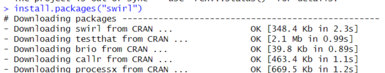
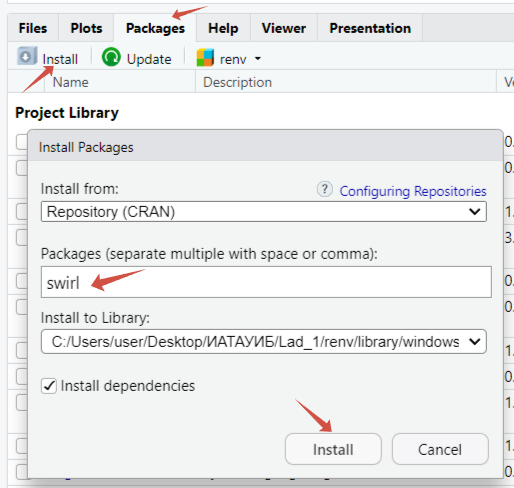
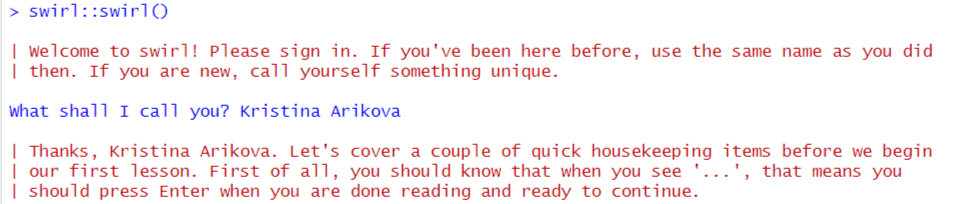
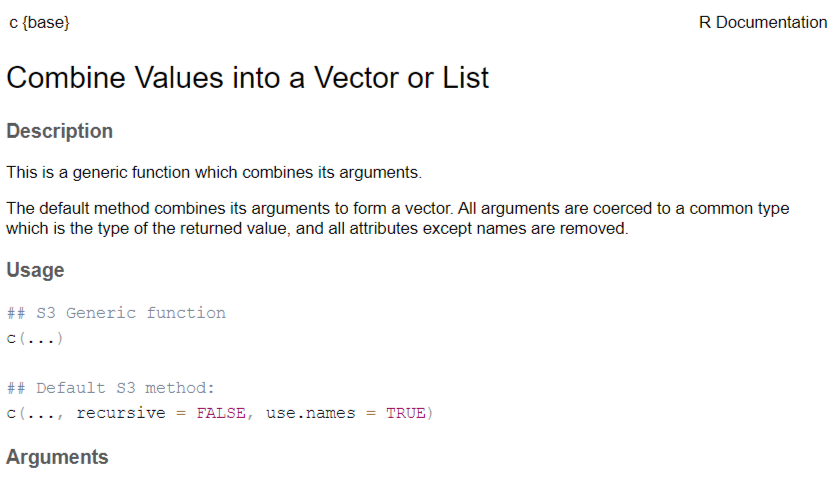

# PR_1
Arikova Kristina
2024-09-07

# Практика 001

По дисциплине “Информационно-аналитические технологии поиска угроз
инорфмационной безопасности”

Введение в R

## Цель работы

1.  Развить практические навыки использования языка программирования R
    для обработки данных
2.  Развить навыки работы в Rstudio IDE: 2.1 установка пакетов 2.2
    работа с проектами в Rstudio 3.3 настройка и работа с Git
3.  Закрепить знания базовых типов данных языка R и простейших операций
    с ними

## Исходные данные

1.  Компьютер
2.  ОС Windows
3.  Rstudio
4.  Библиотека swirl
5.  Github

## Общий план выполнения работы

1.  Установить интерпретатор R
2.  Установить Rstudio IDE
3.  Установить программный пакет swirl:
4.  Запустить задание
5.  Запустить подкурсы и выполнить: 5.1 базовые структурные блоки (Basic
    Building Blocks) 5.2 рабочие пространства и файлы (Workspace and
    Files) 5.3 последовательности чисел (Sequences of Numbers) 5.4
    векторы (Vectors) 5.5 пропущенные значения (Missing Values)
6.  Составить отчет и выложить его и исходный qmd/rmd файл в свой
    репозиторий Github

## Содержание ЛР

### Шаг 1. Установка интерпретатора R

На данном шаге производится настройка рабочего окружения, а именно
установка интерпретатора R. 1. На сайте posit скачиваем R.

 2. На cran.rstudio.com
выбираем интерпретатор R для ОС Windows.

 3. С помощью установочного
файла загружаем R.

<figure>

<figcaption aria-hidden="true"><em>1.3. Установка R</em></figcaption>
</figure>

### Шаг 2. Установка Rstudio IDE

На данном шаге продолжается настройка рабочего окружения, а именно
установка ПО Rstudio IDE.

1.  На сайте posit скачиваем Rstudio

 2. С помощью
установочного файла загружаем Rstudio.

<figure>

<figcaption aria-hidden="true"><em>2.2. Установка
Rstudio</em></figcaption>
</figure>

### Шаг 3.Установка программного пакета swirl

Есть 2 способа скачать:

1.  написать в консоли следующую строчку и нажать Enter:

<!-- -->

    `install.packages("swirl")`

<figure>

<figcaption aria-hidden="true"><em>3.1. Установка
swirl</em></figcaption>
</figure>

2.Выполнить установку в Packages RStudio.

 \### Шаг 4. Запуск
задания

На данном этапе происходит запуск задания с помошью следующей команды:

`swirl::swirl()`

<figure>

<figcaption aria-hidden="true"><em>4.1. Запуск задания</em></figcaption>
</figure>

После запуска задания выбран курс 1. R Programming: The basics of
programming in R

 \### Шаг 5. Выполнение
покурсов 5.1. Basic Building Blocks Основная информация курса: 1. Способ
присвоения значения переменной в R заключается в использовании оператора
присваивания, который представляет собой просто символ “меньше, чем”, за
которым следует знак “минус”. Это выглядит следующим образом: \<- 2.
Чтобы просмотреть содержимое переменной, необходимо ввести ее и нажать
Enter 3. Любой объект, содержащий данные называются структурой данных, а
числовые векторы являются простейшим типом структуры данных в R. На
самом деле, даже одно число считается вектором длиной в единицу. 4.
Самый простой способ создать вектор - это использовать функцию c()
`z <- c(1.1, 9, 3.14)` 5. В любое время, когда у вас возникнут вопросы
по той или иной функции, вы можете получить доступ к встроенной справке
с помощью команды “?” `?c` 

    6.Можно объединить векторы, чтобы создать новый вектор.
    `(z, 555, z)`
    `[1]   1.10   9.00   3.14 555.00   1.10   9.00   3.14`
    7.Числовые векторы могут использоваться в арифметических выражениях.
    `z * 2 + 100`
    `[1] 102.20 118.00 106.28`
    Сначала R умножил каждый из трех элементов в z на 2. Затем он добавил по 100 к каждому элементу.
    7. Чтобы извлечь квадратный корень, используйте функцию sqrt(), а чтобы получить абсолютное значение, используйте функцию abs().
    `my_sqrt <- sqrt(z - 1)`
    `my_sqrt`
    `[1] 0.3162278 2.8284271 1.4628739`
