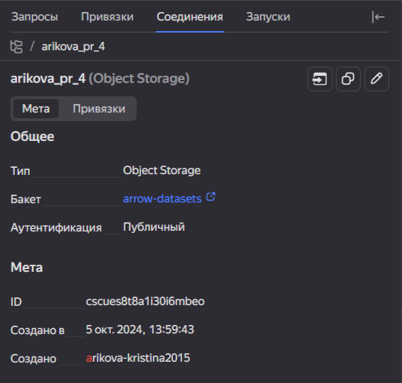
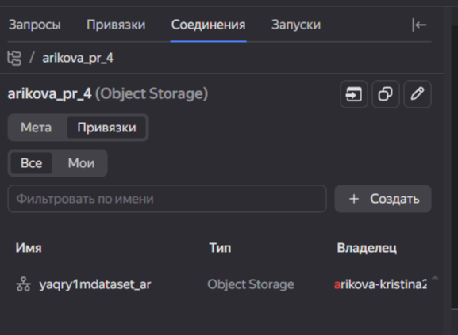
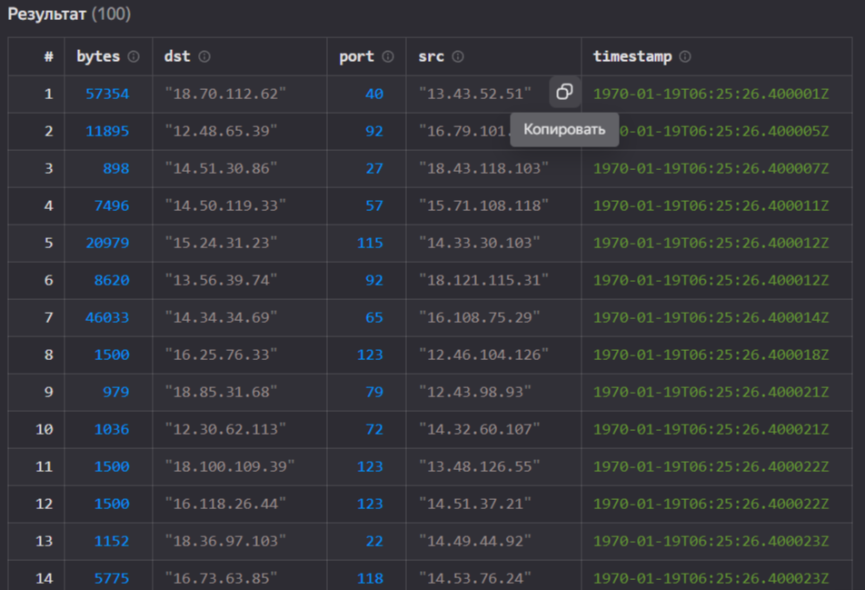
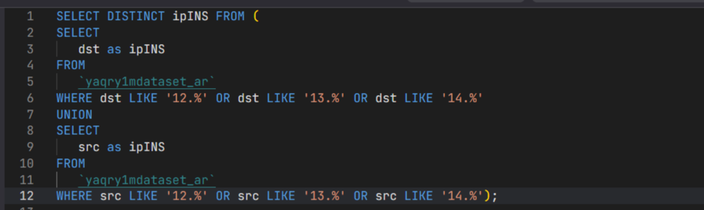
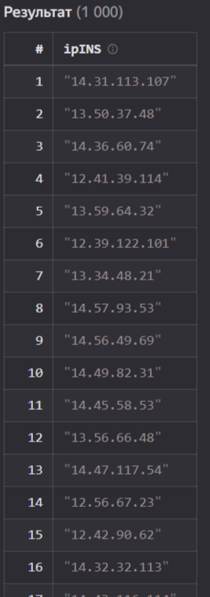
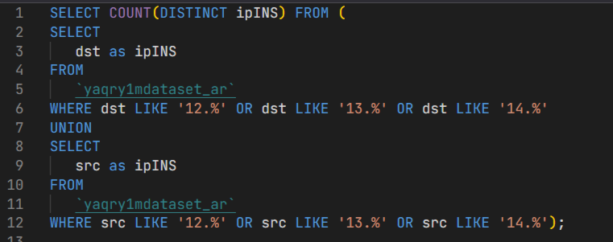
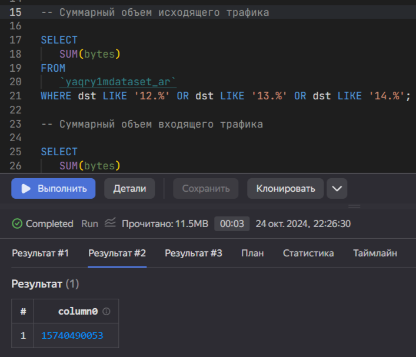
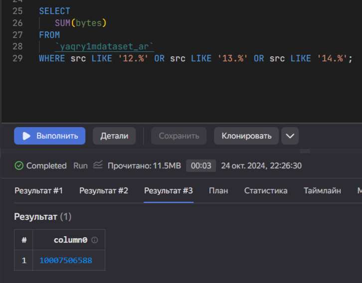

# Практика 004
Arikova Kristina
2024-10-05

Использование технологии Yandex Query для анализа данных сетевой
активности

## Цель

1.  Изучить возможности технологии Yandex Query для анализа
    структурированных наборов данных

2.  Получить навыки построения аналитического пайплайна для анализа
    данных с помощью сервисов Yandex Cloud

3.  Закрепить практические навыки использования SQL для анализа данных
    сетевой активности в сегментированной корпоративной сети

## Исходные данные

-   Компьютер

-   ОС Windows

-   Яндекс Браузер

-   Сервисы Yandex Cloud, Yandex Query

## Общий план выполнения

1.  Используя сервис Yandex Query настроить доступ к данным, хранящимся
    в сервисе хранения данных Yandex Object Storage
2.  Проверить доступность данных в Yandex Object Storage
3.  Решить аналитические задачи с помощью SQL запросов

## Содержание ЛР

### Шаг 1. Настройка Yandex Query

Настройка и подключение к общей организации Yandex Query выполенена на
основе методичкеских указаний.

<figure>

<figcaption aria-hidden="true">Рисунок 1. Подключение к общей
области</figcaption>
</figure>

<figure>

<figcaption aria-hidden="true">Рисунок 2. Настроено соединение с
указанием источника данных</figcaption>
</figure>

<figure>

<figcaption aria-hidden="true">Рисунок 3. Настроена привязка
данных</figcaption>
</figure>

``` r
print("Yandex Query is configured")
```

    [1] "Yandex Query is configured"

### Шаг 2. Проверка доступа к данным Yandex Object Storage

Для проверки доступа к данным выведем 100 записей с помощью следующего
запроса (рис. 4).

<figure>

<figcaption aria-hidden="true">Рисунок 4. Запрос</figcaption>
</figure>

<figure>

<figcaption aria-hidden="true">Рисунок 5. Вывод запроса</figcaption>
</figure>

### Шаг 3. Решение аналитических задач

#### Задача 1. Определите количество хостов внутренней сети, представленных в датасете.

Выведем уникальные хосты внутренней сети в одной таблице с помощью сл.
запороса (рис. 6).

<figure>

<figcaption aria-hidden="true">Рисунок 6. Запрос</figcaption>
</figure>

<figure>

<figcaption aria-hidden="true">Рисунок 7. Вывод</figcaption>
</figure>

Определим их количество с помощью сл. запроса (рис. 8).

<figure>

<figcaption aria-hidden="true">Рисунок 8. Запрос</figcaption>
</figure>

<figure>

<figcaption aria-hidden="true">Рисунок 9. Результат</figcaption>
</figure>

Ответ: 1000 хостов внутренней сети.

#### 

Задача 2. Определите суммарный объем исходящего трафика.

Суммарный объем исходящего трафика определен с помощью сл. запроса (рис.
10).

<figure>

<figcaption aria-hidden="true">Рисунок 10. Исходящий трафик</figcaption>
</figure>

Ответ: 15740490053.

#### 

Задача 3. Определите суммарный объем входящего трафика.

Суммарный объем входящего трафика определен с помощью сл. запроса (рис.
11).

<figure>

<figcaption aria-hidden="true">Рисунок 11. Входящий трафик</figcaption>
</figure>

Ответ: 10007506588.

## Оценка результата

Изучены возможности технологии Yandex Query для анализа
структурированных наборов данных и закреплены знания SQL-запросов для
анализа данных сетевой активности в сегментированной корпоративной сети.

## Вывод

Yandex Query - отличный инструмент для работы с анализом данных, в
котором задачи организации хранения, обеспечения доступа и выполнения
первичного анализа данных полностью берет на себя сервис-провайдер
Yandex Cloud.
