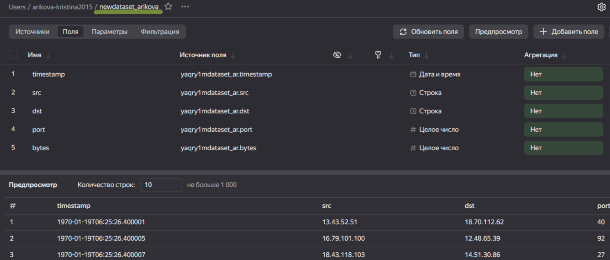
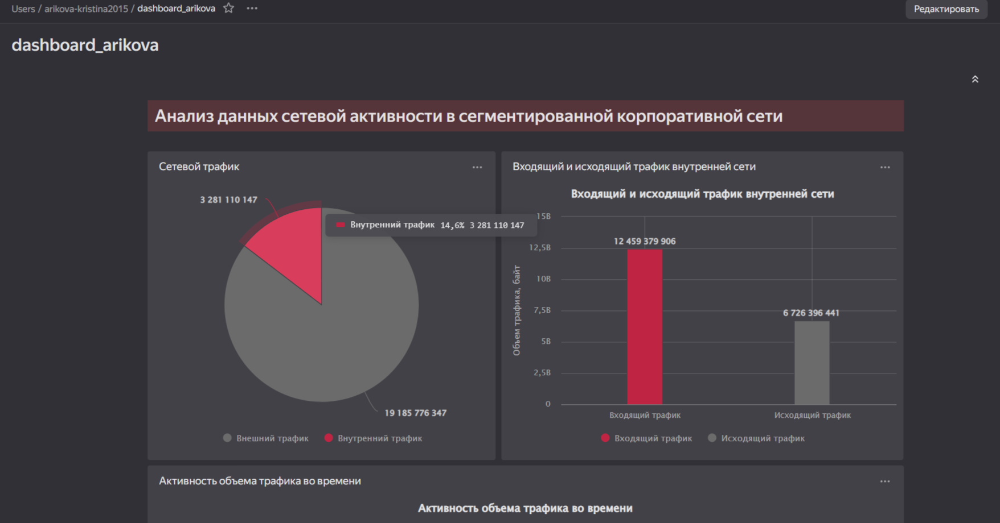
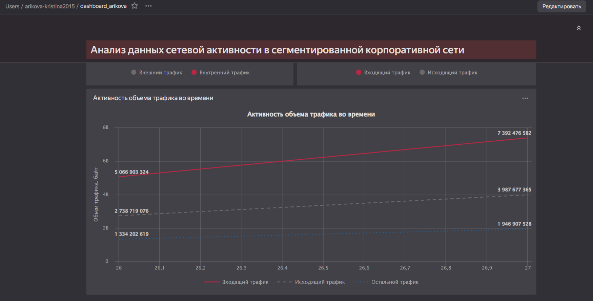

# Практика 006
Arikova Kristina
2024-11-18

## Использование технологии Yandex Query для анализа данных сетевой активности

## Цель

1.  Изучить возможности технологии Yandex Query для анализа
    структурированных наборов данных

2.  Получить навыки построения аналитического пайплайна для анализа
    данных с помощью сервисов Yandex Cloud

3.  Закрепить практические навыки использования SQL для анализа данных
    сетевой активности в сегментированной корпоративной сети

## Исходные данные

-   Компьютер

-   ОС Windows

-   Яндекс Браузер

-   Сервисы Yandex Cloud, Yandex Query

## Общий план выполнения

1.  Используя сервис Yandex Query настроить доступ к данным, хранящимся
    в сервисе хранения данных Yandex Object Storage
2.  Настроить подключение к Yandex Query из DataLens
3.  Создать из запроса Yandex Query датасет DataLens
4.  Решение аналитических задач

## Содержание ЛР

### Шаг 1. Настройка Yandex Query и подключение данных в Yandex Object Storage

Настройка и подключение к общей организации Yandex Query выполенена на
основе методичкеских указаний и представлена в [отчете по практической
работе
№4](https://github.com/gigwrld/Threat_Hunt_Arikova/tree/main/PR_4).

``` r
print("Yandex Query is configured")
```

    [1] "Yandex Query is configured"

### Шаг 2. Настроить подключение к Yandex Query из DataLens

Создано и настроено новое подключение датасета к Yandex Query из
DataLens.

<figure>

<figcaption aria-hidden="true">Рис. 1 - Новое подключение</figcaption>
</figure>

### Шаг 3. Создать из запроса Yandex Query датасет DataLens

Создан датасет для дальнейшего анализа данных.

<figure>

<figcaption aria-hidden="true">Рис. 2 - Содержимое датасета</figcaption>
</figure>

### Шаг 4. Решение аналитических задач

1.  Представлено в виде круговой диаграммы соотношение внешнего и
    внутреннего сетевого трафик

<figure>

<figcaption aria-hidden="true">Рис. 3 - Сетевой трафик</figcaption>
</figure>

В параметре ЦВЕТ представлена следующая функция на языке SQL:

IF ((\[dst\] LIKE ‘12.%’ OR \[dst\] LIKE ‘13.%’ OR \[dst\] LIKE ‘14.%’)
AND (\[src\] LIKE ‘12.%’ OR \[src\] LIKE ‘13.%’ OR \[src\] LIKE ‘14.%’))
THEN “Внутренний трафик” ELSE “Внешний трафик” END

В параметре ПОКАЗАТЕЛИ и ПОДПИСИ представлено количество байт
передаваемого трафика.

1.  Представлено в виде столбчатой диаграммы соотношение входящего и
    исходящего трафика из внутреннего сетвого сегмента.

<figure>

<figcaption aria-hidden="true">Рис. 4 - Трафик внутренней
сети</figcaption>
</figure>

В качетве параметров Y и ПОДПИСИ выбрано количество байт передаваемоего
трафика, а в качетве пареметров X и ЦВЕТА представлена следующая функция
на языке SQL:

IF ((\[src\] LIKE ‘12.%’ OR \[src\] LIKE ‘13.%’ OR \[src\] LIKE ‘14.%’)
AND (NOT(\[dst\] LIKE ‘12.%’ OR \[dst\] LIKE ‘13.%’ OR \[dst\] LIKE
‘14.%’))) THEN “Исходящий трафик” ELSEIF ((\[dst\] LIKE ‘12.%’ OR
\[dst\] LIKE ‘13.%’ OR \[dst\] LIKE ‘14.%’) AND (NOT(\[src\] LIKE ‘12.%’
OR \[src\] LIKE ‘13.%’ OR \[src\] LIKE ‘14.%’))) THEN “Входящий трафик”
END

1.  Построен график активности (линейная диаграмма) объема трафика во
    времени.

<figure>

<figcaption aria-hidden="true">Рис. 5 - Активность трафика</figcaption>
</figure>

В качетве параметра Y взято количество байт передаваемоего трафика, а в
качетве пареметров X и ЦВЕТА и ФОРМЫ представлена следующая функция на
языке SQL:

IF ((\[src\] LIKE ‘12.%’ OR \[src\] LIKE ‘13.%’ OR \[src\] LIKE ‘14.%’)
AND (NOT(\[dst\] LIKE ‘12.%’ OR \[dst\] LIKE ‘13.%’ OR \[dst\] LIKE
‘14.%’))) THEN “Исходящий трафик” ELSEIF ((\[dst\] LIKE ‘12.%’ OR
\[dst\] LIKE ‘13.%’ OR \[dst\] LIKE ‘14.%’) AND (NOT(\[src\] LIKE ‘12.%’
OR \[src\] LIKE ‘13.%’ OR \[src\] LIKE ‘14.%’))) THEN “Входящий трафик”
ELSE “Остальной трафик” END

1.  Все построенные графики выведены в виде единого дашборда в Yandex
    DataLens.

<figure>

<figcaption aria-hidden="true">Рис. 6 - Дашборд - часть 1</figcaption>
</figure>

<figure>

<figcaption aria-hidden="true">Рис. 7 - Дашборд - часть 2</figcaption>
</figure>

Ссылка на
[дашборд](https://datalens.yandex.cloud/s6j1qqn2mhzif-dashboard-arikova)

Ссылка на [публичный дашборд](https://datalens.yandex/s6j1qqn2mhzif)

## Оценка результата

Изучены возможности технологии Yandex Query для анализа
структурированных наборов данных и закреплены знания SQL-запросов для
анализа данных сетевой активности в сегментированной корпоративной сети.
А также, используя сервис Yandex DataLens, настроен доступ к Yandex
Query, приведены аналитические отчеты данных сетевой активности в
сегментированной корпоративной сети.

## Вывод

Yandex DataLens - сервис анализа и визуализации данных от Yandex Cloud.
Yandex DataLens имеет простой и понятный интерфейс, который позволяет
пользователям быстро начать работу с данными, предоставляет множество
функций для анализа данных, включая визуализацию, создание отчётов и
прогнозировани.
