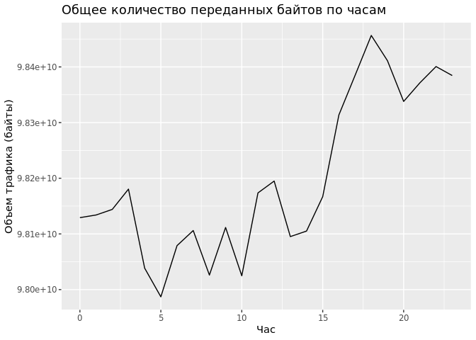

# Практика 007
Arikova Kristina
2024-12-08

Анализ данных сетевого трафика при помощи библиотеки Arrow

## Цель

1.  Изучить возможности технологии Apache Arrow для обработки и анализ
    больших данных

2.  Получить навыки применения Arrow совместно с языком программирования
    R3.

3.  Получить навыки анализа метаинфомации о сетевом трафике

4.  Получить навыки применения облачных технологий хранения, подготовки
    и  
    анализа данных: Yandex Object Storage, Rstudio Server.

## Исходные данные

-   Компьютер

-   ОС Windows

-   Rstudio Server

-   Github

-   Yandex Object Storage

## Общий план выполнения

1.  Подготовка рабочего окружения
2.  Задание 1: Надите утечку данных из Вашей сети
3.  Задание 2: Надите утечку данных 2
4.  Задание 3: Надите утечку данных 3

## Содержание ЛР

### Шаг 1. Подготовка рабочего окружения

Подключен доступ к Rstudio Server и Yandex Object Storage.

Подготовка данных:

``` r
#download.file('https://storage.yandexcloud.net/arrow-datasets/tm_data.pqt', destfile = "tm_data.pqt")
```

``` r
library(arrow)
```

    Some features are not enabled in this build of Arrow. Run `arrow_info()` for more information.


    Attaching package: 'arrow'

    The following object is masked from 'package:utils':

        timestamp

``` r
df <- arrow::read_parquet("tm_data.pqt", use_threads=False)
```

### Шаг 2. Надите утечку данных из Вашей сети

Задание 1. Важнейшие документы с результатами нашей исследовательской
деятельности в области создания вакцин скачиваются в виде больших
заархивированных дампов.  
Один из хостов в нашей сети используется для пересылки этой информации –
он пересылает гораздо больше информации на внешние ресурсы в Интернете,
чем остальные компьютеры нашей сети. Определите его IP-адрес. Посмотрим
стуктуру данных:

``` r
library(dplyr)
```


    Attaching package: 'dplyr'

    The following objects are masked from 'package:stats':

        filter, lag

    The following objects are masked from 'package:base':

        intersect, setdiff, setequal, union

``` r
library(tidyverse)
```

    ── Attaching core tidyverse packages ──────────────────────── tidyverse 2.0.0 ──
    ✔ forcats   1.0.0     ✔ readr     2.1.5
    ✔ ggplot2   3.5.1     ✔ stringr   1.5.1
    ✔ lubridate 1.9.3     ✔ tibble    3.2.1
    ✔ purrr     1.0.2     ✔ tidyr     1.3.1
    ── Conflicts ────────────────────────────────────────── tidyverse_conflicts() ──
    ✖ lubridate::duration() masks arrow::duration()
    ✖ dplyr::filter()       masks stats::filter()
    ✖ dplyr::lag()          masks stats::lag()
    ℹ Use the conflicted package (<http://conflicted.r-lib.org/>) to force all conflicts to become errors

``` r
glimpse(df)
```

    Rows: 105,747,730
    Columns: 5
    $ timestamp <dbl> 1.578326e+12, 1.578326e+12, 1.578326e+12, 1.578326e+12, 1.57…
    $ src       <chr> "13.43.52.51", "16.79.101.100", "18.43.118.103", "15.71.108.…
    $ dst       <chr> "18.70.112.62", "12.48.65.39", "14.51.30.86", "14.50.119.33"…
    $ port      <int> 40, 92, 27, 57, 115, 92, 65, 123, 79, 72, 123, 123, 22, 118,…
    $ bytes     <int> 57354, 11895, 898, 7496, 20979, 8620, 46033, 1500, 979, 1036…

``` r
leakage1 <- df %>% filter(grepl("^(12|13|14)\\.", src)) %>% group_by(src) %>% summarise("sum" = sum(bytes)) %>% arrange(desc(sum)) %>% head(1) %>% select(src) 
leakage1
```

    # A tibble: 1 × 1
      src         
      <chr>       
    1 13.37.84.125

**Ответ: 13.37.84.125** - IP-адрес, пересылающий наибольшее количество
информации на внешние ресурсы.

### Шаг 3. Надите утечку данных 2

Задание 2. Другой атакующий установил автоматическую задачу в системном
планировщик еcron для экспорта содержимого внутренней wiki системы. Эта
система генерирует большое количество трафика в нерабочие часы, больше
чем остальные хосты.  
Определите IP этой системы. Известно, что ее IP адрес отличается от
нарушителя из предыдущей задачи.

Определим рабочее время по количеству передаваемого трафика:

``` r
library(ggplot2)
```

``` r
working_hours <- df %>% mutate(trafic = (str_detect(src, "^((12|13|14)\\.)") & !str_detect(dst, "^((12|13|14)\\.)"))) %>% mutate(time = as.POSIXct(df$timestamp)) %>% mutate(hour = hour(time))  %>% group_by(hour) %>% summarise(total_bytes = sum(bytes, na.rm = TRUE)) %>% arrange(hour)
```

``` r
ggplot(working_hours, aes(x = hour, y = total_bytes)) +
  geom_line() +
  labs(title = "Общее количество переданных байтов по часам", x = "Час", y = "Объем трафика (байты)")
```



Определены нерабочие часы: 00:00 - 15:00.

``` r
result <- df %>% mutate(time = as.POSIXct(df$timestamp)) %>%  mutate(hour = hour(time))  %>% filter(src != '13.37.84.125') %>% filter(str_detect(src, "^((12|13|14)\\.)")) %>% filter(!str_detect(dst, "^((12|13|14)\\.)")) %>%  filter(hour >= 0 & hour <= 15) %>%
  group_by(src) %>%
  summarise(total_bytes = sum(bytes)) %>%
  arrange(desc(total_bytes))
head(result, 1)
```

    # A tibble: 1 × 2
      src         total_bytes
      <chr>             <int>
    1 13.48.72.30  1150750872

**Ответ: 13.48.72.30 ???**

### Шаг 4. Надите утечку данных 3

Задание 3. Еще один нарушитель собирает содержимое электронной почты и
отправляет в Интернет используя порт, который обычно используется для
другого типа трафика.  
Атакующий пересылает большое количество информации используя этот порт,
которое нехарактерно для других хостов, использующих этот номер порта.  
Определите IP этой системы. Известно, что ее IP адрес отличается от
нарушителей из предыдущих задач.

``` r
port_traf <- df %>% 
  select(src, port, bytes, dst) %>% filter(grepl("^(12|13|14)\\.", src), src != '13.37.84.125', src != '12.55.77.96', !str_detect(dst, "^((12|13|14)\\.)")) %>% 
  group_by(port) %>%
  summarise(med = median(bytes), max = max(bytes), razn = max - med) %>%
  arrange(desc(razn))

head(port_traf, 10)
```

    # A tibble: 10 × 4
        port    med    max    razn
       <int>  <dbl>  <int>   <dbl>
     1    37 30669  209402 178733 
     2    39 30713  198527 167814 
     3   105 30598. 197766 167168.
     4    40 30579  195144 164565 
     5    75 30685  194650 163965 
     6    89 30628  194106 163478 
     7   102 30645  193588 162943 
     8    81 30721  192430 161709 
     9   119 30623  190151 159528 
    10    74 30679  189818 159139 

Наибольшая разница между медианой и максимальным значением у порта 37.
Рассмотрим количество трафика у IP, передаваемый через порт 37.

``` r
port37<- df %>% 
  select(src, port, bytes, dst) %>%  filter(grepl("^(12|13|14)\\.", src), src != '13.37.84.125', src != '12.55.77.96', !str_detect(dst, "^((12|13|14)\\.)")) %>% 
  filter(port == 37) %>% 
  group_by(src) %>%
  summarise(traffic = sum(bytes), count = n(), avg = traffic/count, med = median(bytes)) %>%
  arrange(desc(med))
head(port37, 1)
```

    # A tibble: 1 × 5
      src          traffic count    avg   med
      <chr>          <int> <int>  <dbl> <dbl>
    1 14.31.107.42 1288614    30 42954. 43732

**Ответ: 14.31.107.42**

## Оценка результата

Получены практические навыки работы с технологией Apache Arrow для
обработки и анализ больших данных.

## Вывод

Проведен анализ метаинфомации о сетевом трафике.
