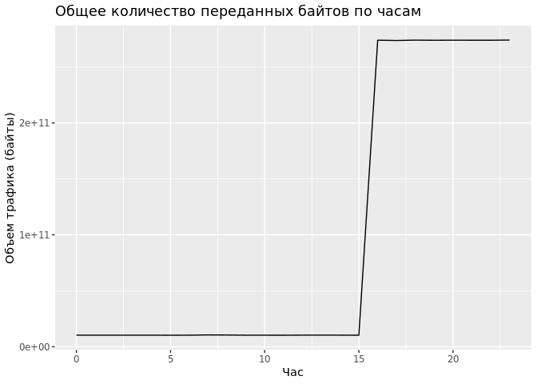

# Практика 008
Arikova Kristina
2024-11-05

Анализ данных сетевого трафика с использованием  
аналитической in-memory СУБД DuckDB.

## Цель

1.  Изучить возможности СУБД DuckDB для обработки и анализ больших
    данных

2.  Получить навыки применения DuckDB совместно с языком
    программирования R3.

3.  Получить навыки анализа метаинфомации о сетевом трафике

4.  Получить навыки применения облачных технологий хранения, подготовки
    и  
    анализа данных: Yandex Object Storage, Rstudio Server.

## Исходные данные

-   Компьютер

-   ОС Windows

-   Rstudio

-   Данные о сетевом трафике tm_data.pqt

-   Github

## Общий план выполнения

1.  Подготовка рабочего окружения
2.  Задание 1: Надите утечку данных из Вашей сети
3.  Задание 2: Надите утечку данных 2
4.  Задание 3: Надите утечку данных 3

## Содержание ЛР

### Шаг 1. Подготовка рабочего окружения

``` r
library(dplyr)
```


    Attaching package: 'dplyr'

    The following objects are masked from 'package:stats':

        filter, lag

    The following objects are masked from 'package:base':

        intersect, setdiff, setequal, union

``` r
library(DBI)
```

``` r
library(duckdb)
```

``` r
#download.file('https://storage.yandexcloud.net/arrow-datasets/tm_data.pqt', destfile = "tm_data.pqt")
```

``` r
con <- dbConnect(duckdb())
dbExecute(con,"CREATE TABLE df as SELECT * FROM read_parquet('tm_data.pqt')")
```

    [1] 105747730

### Шаг 2. Надите утечку данных из Вашей сети

Задание 1. Важнейшие документы с результатами нашей исследовательской
деятельности в области создания вакцин скачиваются в виде больших
заархивированных дампов.  
Один из хостов в нашей сети используется для пересылки этой информации –
он пересылает гораздо больше информации на внешние ресурсы в Интернете,
чем остальные компьютеры нашей сети. Определите его IP-адрес.

Хосты нашей сети - IP, начинающиеся на 12-14., определим наибольшее
количество передаваемого трафика из этих сетей во внешние.

``` r
dbGetQuery(con,
"SELECT src FROM df
WHERE (src LIKE '12.%' OR src LIKE '13.%' OR src LIKE '14.%') AND NOT (dst LIKE '12.%' AND dst LIKE '13.%' AND dst LIKE '14.%')
GROUP BY src
ORDER BY sum(bytes) DESC LIMIT 1")
```

               src
    1 13.37.84.125

**Ответ: 13.37.84.125**

### Шаг 3. Надите утечку данных 2

Задание 2. Другой атакующий установил автоматическую задачу в системном
планировщикеcron для экспорта содержимого внутренней wiki системы. Эта
система генерирует большое количество трафика в нерабочие часы, больше
чем остальные хосты.  
Определите IP этой системы.

Определим нерабочие часы системы:

``` r
working_hours <- dbGetQuery(con,
"SELECT time, SUM(bytes) AS trafic FROM (
    SELECT 
        (src LIKE '12.%' OR src LIKE '13.%' OR src LIKE '14.%') AND NOT (dst LIKE '12.%' AND dst LIKE '13.%' AND dst LIKE '14.%') AS ip,
        bytes,
        EXTRACT(HOUR FROM epoch_ms(CAST(timestamp AS BIGINT))) AS time
    FROM df
) sub
GROUP BY time
ORDER BY trafic")
```

``` r
library(ggplot2)
```

``` r
ggplot(working_hours, aes(x = time, y = trafic)) +
  geom_line() +
  labs(title = "Общее количество переданных байтов по часам", x = "Час", y = "Объем трафика (байты)")
```



Нерабочие часы: 00:00 - 15:00.

``` r
dbGetQuery(con,"
SELECT src, SUM(bytes) AS total_bytes
FROM df
WHERE EXTRACT(HOUR FROM epoch_ms(CAST(timestamp AS BIGINT))) BETWEEN 0 AND 15
  AND (src LIKE '12.%' OR src LIKE '13.%' OR src LIKE '14.%')
  AND (dst NOT LIKE '12.%' AND dst NOT LIKE '13.%' AND dst NOT LIKE '14.%')
  AND (src != '13.37.84.125')
GROUP BY src
ORDER BY total_bytes DESC
LIMIT 1;
")
```

              src total_bytes
    1 12.55.77.96   289566918

**Ответ: 12.55.77.96**

### Шаг 4. Надите утечку данных 3

Еще один нарушитель собирает содержимое электронной почты и отправляет в
Интернет используя порт, который обычно используется для другого типа
трафика.  
Атакующий пересылает большое количество информации используя этот порт,
которое нехарактерно для других хостов, использующих этот номер порта.  
Определите IP этой системы.

  

## Оценка результата

## Вывод
